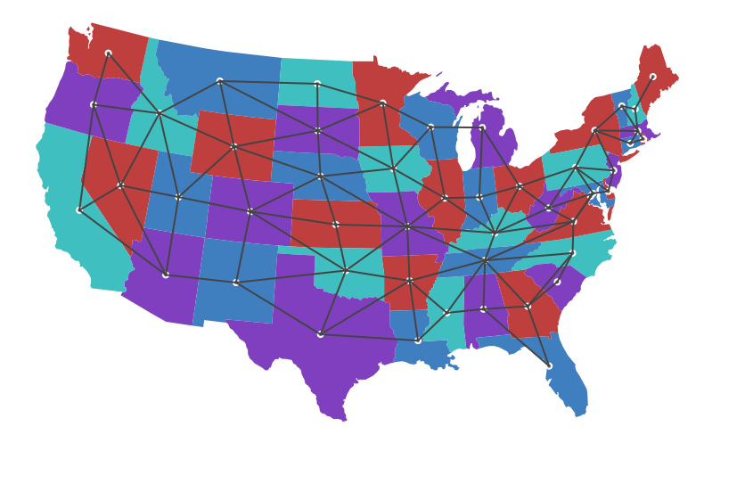

A example of a map coloring
======

This is a simple project that shows how to use the D3-driven [datamaps](http://datamaps.github.io) to create a custom animation. It demonstrates the use of "bubbles" and choropleths, as well as being a demonstration of how to animate using D3.

### Files
- `index.html`: the main document. Includes all custom styling and JS.
- `connect.json`: contains the information about which states share a border, and which color class each state is in. The colors are **not** calculated in the script, but were taken from [this page](http://mathworld.wolfram.com/ContiguousUSAGraph.html).
- `capitals.json`: (Not used) JSON object containing longitude and latitude information for all US state capitals.
- `adjacenct.csv`: (Not used) CSV file containing an adjacency list for US states. Originally created by [Gregg Lind]( http://writeonly.wordpress.com/2009/03/20/adjacency-list-of-states-of-the-united-states-us/).
- `dist/datamaps.usa.min.js`: Information from datamaps that allows us to quickly construct a map of the US.
- `README.md`: this file.

### Final frame output:

